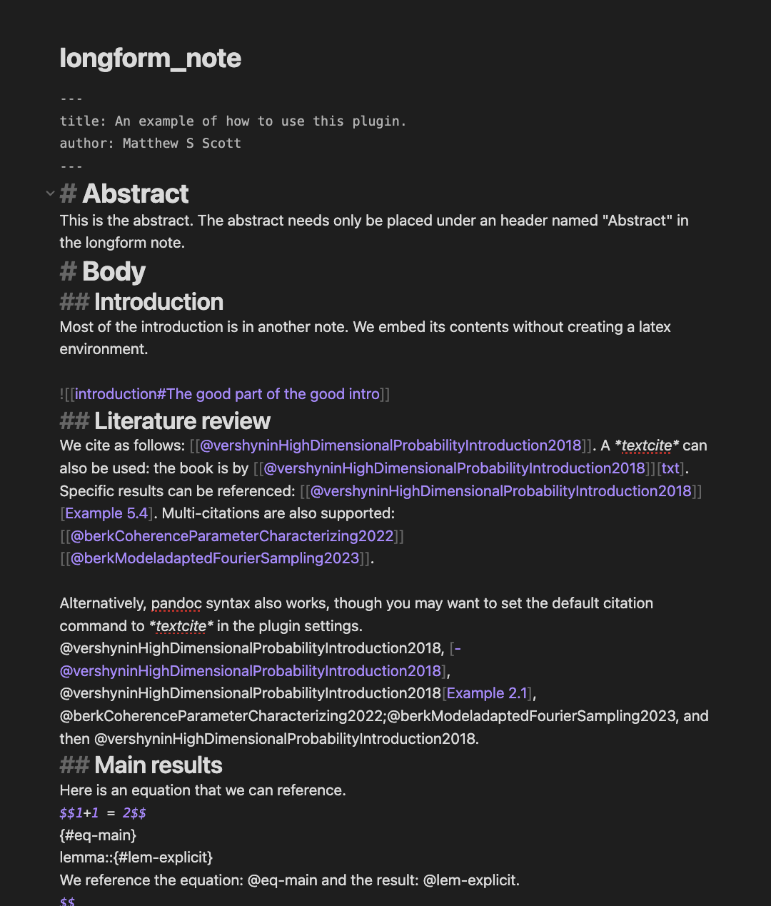
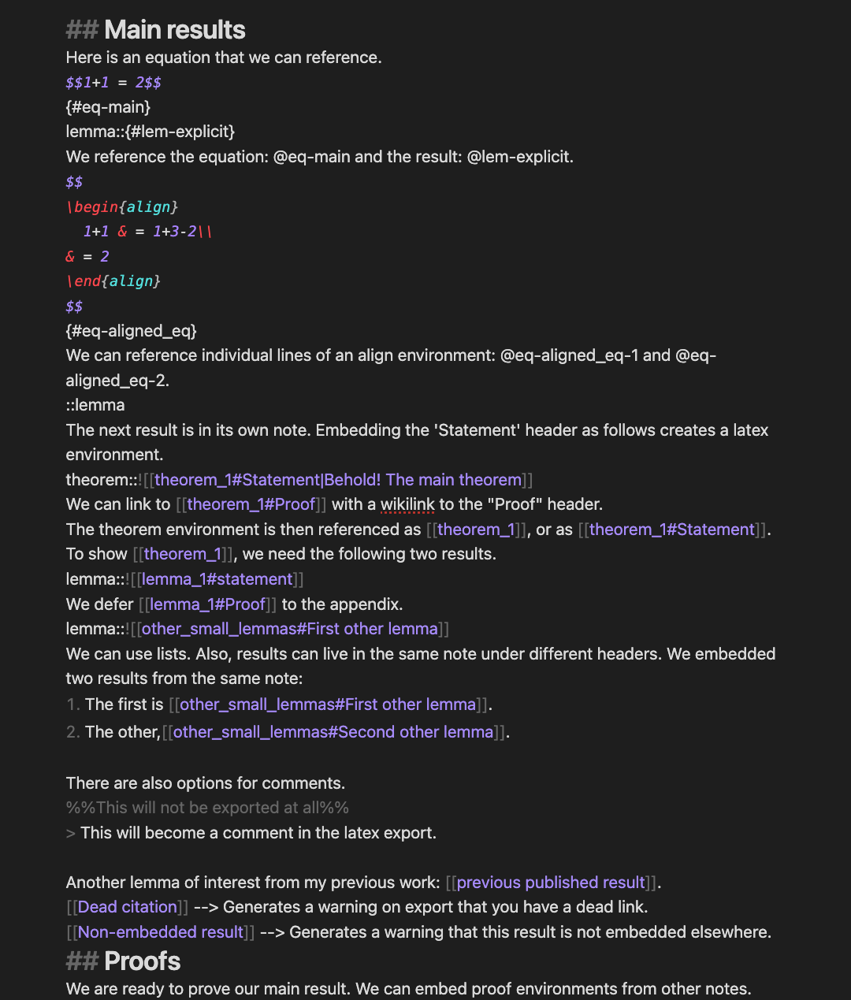
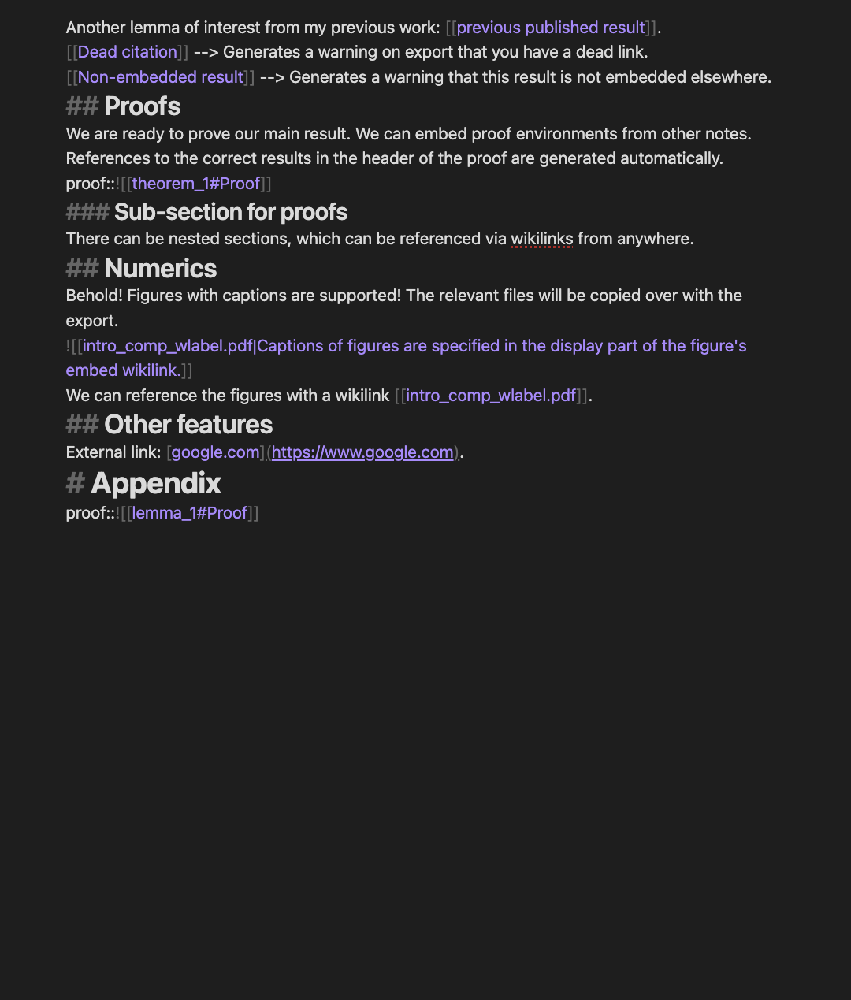

# Latex Exporter
Write a paper directly in Obsidian! Export an Obsidian note to a full-fledged LaTeX paper, including embedded content, LaTeX environments, citations, references, LaTeX sections, figures and more. All content that is visible in obsidian will be included in the export!
## Features
This plugin supports:
- Embedded content, including embedded content from headers.
- LaTeX environments (e.g. \begin{theorem} environment, or lemma, etc.)
- Seemless references to LaTeX environments from wikilinks.
- Citations: of many kinds, including multi-citations.
- LaTeX sections from Markdown headers (and subsections, etc.)
- References to sections.
- Equation references, including within `align` environments.
- Title and author from the yaml header.
- Specialized abstract and appendix sections.
- Template-based exports.
- Selection export to the clipboard.
- Conversion of most markdown elements supported by Obsidian to equivalents in latex.
- Export of markdown quotes to LaTeX comments.
- Obsidian comments `%%...%%` excluded from the export.

This plugin is best used with plugins:
- Zotero integration (see https://mscott99.github.io/matthew_s_scott_zettel/Setup%20workflows/Setup%20citations/ to configure the settings appropriately), or Citations (almost required to work with citations.)
- Breadcrumbs.
- Extended MathJax, to use latex macros both in Obsidian and in the export.

## Purpose and concept
Currently, converting a set of notes in a vault to a linear polished text is a non-trivial task. This is an obstacle in the overall writing task which fragments the writing accross tools: note-taking in Obsidian, followed by final writing in Overleaf. With this plugin, a single unified workflow becomes possible, spanning from ideation all the way to the final product. Keep writing your paper in Obsidian until you have polished the content, and your completed paper is a click away (though you may want to validate the formatting in LaTeX.) With this plugin, your paper can emerge organically from your graph of notes.

Here is how it works. The user should create a "longform" note which structures the content primarily through embed links (transclusions). The longform note specifies the sections and assembles content from other notes into a linear piece of writing. The paper should be readable from this note alone when viewed in Obsidian, even though the content may be spread accross your vault. Then exporting this embed-heavy note will extracts relevant content from your vault and create a single LaTeX output file.

For example, say you have a theorem which you would like to include in your paper. The theorem should reside in its own note, with the statement under the `Statement` header and its proof under the `Proof` header. Then in the longform note, 
you may want to include the statement of the theorem in the introduction, which is done with the syntax `theorem::![[theorem_note#Statement]]`. Yet you may defer the proof to a later section. In that later section, you embed the proof with `proof::![[theorem_note#Proof]]`. Hyperlinks between the theorem and the proof will be automatically generated on export. Then what if you want to reference this theorem? You only need a standard wikilink, `[[theorem_note]]`. Note that each one of these embedding statements do not need to be in the longform note, or even in the same note! They merely need to be in a place which is visible in Obsidian from your longform note.

This plugin uses the information found in the graphical organisation of notes to create a sensible LaTeX document. It is not attempting to match the obsidian note visually, only its content. The LaTeX code in the export is minimal as much as possible, so that the author can later edit it if necessary.
## Example
See the sub-directory `example/vault` of the repository hosting this plugin for an example of an export. The corresponding pdf can be found [here](example/export/longform_note_output.pdf).
| Obsidian | LaTeX Export |
| ---- | ----- |
| | |
|| |
|| |
|||

## How to use: the commands
### `Latex Exporter:Export current note`
Navigate to the "longform" note that you would like to export, and run the command `Export to paper`. The plugin will create a folder in the root of your vault (or in the appropriate sub-folder inside your vault, if specified in the settings of the plugin), and will write all required files to this folder. The entire content inside the longform note will be exported, except if there is an h1 header named `Body` in the note, in which case only the content under `Body` will be exported. Additionally, content h1 headers `Abstract` and `Appendix` will be exported appropriately.

To use citations, place a bib file named `bibliography.bib` in the root of your vault; it will be copied upon export to the correct location. Also, a you may place a file `preamble.sty` containing a LaTeX preamble in the root of the vault, which will also be copied. The `preamble.sty` file is meant to be used with the Extended MathJax plugin.

*Using a template*: In the settings, it is possible to specify the path to a template file. If this field is left blank, then the plugin will generate minimal LaTeX code required for the export to compile well. To use a template, place a template file inside your vault and specify its path in the plugin settings. A template file should contains LaTeX code with a pandoc-style anchor `$body$`, to be replaced by the converted content of the longform note. The anchors `$abstract$` and `$appendix$` can optionally be specified.
#### Overwriting behaviour
Before making manual changes to the exported LaTeX file, first copy the newly-generated folder to a different location, because re-running the export command from the same note will overwrite the exported LaTeX file (surrounding files, like the preamble or bib file, will not be overwritten). This behaviour is meant to facilitate editing the obsidian files while seeing the updated LaTeX output quickly.
### `Latex Exporter:Export selection to clipboard`
This command exports the selected portion of the current note to the clipboard. To use this command, navigate to the note of interest, go to the editing view (it does not work in reading view), select a portion of the note by dragging your cursor, and while the text is selected run `Cmd+P` and select the command `Latex Exporter:Export selection`. Be warned that the LaTeX exported using this method will only compile well if pasted into a document that imports the relevant LaTeX packages.
### Warnings
Heed the warnings! They are meant to be helpful feedback as to what can be expected to fail based on the structure of the exported content. For example, you may have a wikilink (which is trying to become a reference) to a header which is not visible from the longform note. To get a good output you should fix the cause of the warnings.

The warnings appear as notices, but these go away quickly. To see them longer, you can find them in the developper console that you can access with `Ctrl + Shift + I` on Windows/Linux, or `Cmd + Option + I` on Mac.
## Behaviour of supported elements
Most markdown elements supported by Obsidian are supported by this plugin, with the notable exception of tables.
### Markdown headers 
h1 headers become Latex sections, h2 and onwards become subsections of the correct depth. If the export occurs within a `Body` h1 header, then these are offset by 1: h2 headers will be sections.
### Latex Environments
There are two ways of specifying LaTeX environments: through embeds and explicitly.
#### Embeded Environments (recommended)
Place your theorem in a note distinct from the longform note. In the theorem note, specify a h1 header `# Statement` under which the statement should be written. If a proof is given, write it under another h1 header in the same note `# Proof`. Then in the main note, embed the statement with the following syntax.
```theorem::![[theorem_note_title#Statement]]```
To provide the proof, write the following at the desired location:
```proof::![[theorem_note_title#Proof]]```

The label `theorem` can be modified to `lemma`, `corollary`, or any other environment name. A hyperlink from the proof to the corresponding result will be created automatically (it will look like `proof of Lemma 3.1`.)

Results embedded in this way are referenced with wikilinks: `[[theorem_note_title]]`. The generated LaTeX label of an embedded environement depends on both the note of origin and the header of origin of the embedded content. This means you may choose to have many results in the same note, under different headers. If no header is specified in the referencing wikilink, the plugin defaults to a possible `Statement` header, i.e., it is no different than if the wikilink was of the form `[[theorem_note_title#Statement]]`. Other headers can be used, e.g. `lemma::![[theorem_note_title#Other Statement]]`. Such a result can be referenced with `[[theorem_note_title#Other Statement]]`. However, only a `Statement` header has an implicit association with a possible `Proof` header in the same file.
#### Explicit environments
LaTeX environments can be written directly in the main note with the following syntax.
```
lemma::
The following is always true.
$$\prod > \sum$$
::lemma{#lem-lem_label}
```
The label `{#lem-lem_label}` is optional. If it is specified, the lemma can be referenced using `@lem-lem_label`. The labels must have the syntax `lem-...`, where the identifier `lem` must be one of the following: `ref, loc, tbl, eq, lem, sec, lst, thm, def, ex, exr, prf, alg`.
### Math
The following syntax is recognized: `$inline_math$`and `$$display_math$$`. Display equations are exported to the `equation*` environment by default, though the LaTeX environment may vary.
### Labelled equations
Equations are labelled with the quarto syntax `$$...$${#eq-my_label}` where the required format is `{#eq-...}`. Equations are referenced with `@eq-my_label`. For `align` environments, labelling goes as follows. 
```
$$\begin{align}
hey &= hi \\
and &= other \\
\end{align}$${#eq-align_label}
```
The first line in the align environment can be referenced with `@eq-align_label-1` and the second with `@eq-align_label-2`, and so on. The reference `@eq-align_label` will not work.
### Direct Embeds
A simple embed `![[Other note]]` without a breadcrumb-like attribute of the style `theorem::` will embed the content into the main note without creating a LaTeX environment, even if this embed wikilink specifies a header. As always in this plugin, embeds are recursive; it is fine to have many layers deep of embeds.
### Citations
Citations are wikilinks starting with the '@' character, immediately followed by the bibtex key. To use this feature it is strongly encouraged to use either the Zotero integration plugin (recommended, and it should be set up so that the citations match the aformentionned format, see https://mscott99.github.io/matthew_s_scott_zettel/Setup%20workflows/Setup%20citations/ for how to do this) or the Citations plugin. Pandoc-style citations are also supported, with some limitations. Any citation with a locator will become a cite command `\\cite`. To get the author names to be displayed, you can set the 'default citation command' option in the plugin settings to "textcite". Citations can also have labels (locators) to reference specific results in a source, in which case they look like `[[@<bibtex_key>]][<label>]` or `@<bibtex_key>[<label>]` and gives an output of `\cite[<label>]{<bibtex_key>}`.

The default citation command is `\cite{}` from the `biblatex` package, although a different default citation command can be set in the settings. If a different default citation command is set, a link of the form `[[@...]][std]` will be converted to `\cite{}`. Specifying `[txt]` as a label will instead ensure the use of `\textcite{}`. If many citations wikilinks are given consecutively without any characters between them, they will be included in a single LaTeX citation command, meaning that `[[@first]][[@second]]` becomes `\\cite{@first, @second}`.
### Figures
Figures are created from embed links of image files, and are recognized by their file suffix. A caption can be added in the display section of the link: `![[image.jpeg|caption text here]]`. There are some themes in Obsidian which will display captions of this kind.

Images will be copied to a subfolder of the output folder named "Files".
#### Excalidraw support
To export excalidraw embedded images, follow the following instructions. 
1. In the Excalidraw settings, enable "Embedding Excalidraw into your Notes and Exporting > Export Settings > Auto-export Settings > Auto-export PNG".
2. Make sure that the png exported by Excalidraw is in the /Files folder at the root of your vault. The embedding wikilink can be to the excalidraw note (instead of the exported png).
### Lists
Both ordered and unordered lists are supported. Lines following a number will be included in the item, regardless of indent. To finish a list, leave a blank line. Nested unordered lists are not supported.
# Known limitations
- Tables are not supported.
- Limited parsing of lists; they are indent-blind.
- Inline code is not supported, and display is not tested.
# Support
If you would like to support me, I appreciate it!        <a href='https://ko-fi.com/I2I712UFPK' target='_blank'></a>  
# Similar projects
- Export to TeX: A very similar plugin. Latex Exporter seems to have more features in the export for references and citations, an Export to TeX has other advantages, such as exporting outside of the vault.
- Obsidian-to-latex: python export tool alternative implementation with a different focus.
- Plugin: Latex-like Theorem & Equation Referencer. It has improved visual appeal withing Obsidian. Compatibility with that plugin is a possible improvement of this plugin.
- Plugin: Copy as LaTeX. Similar to the `Export selection` command, but without support for embedded content.
